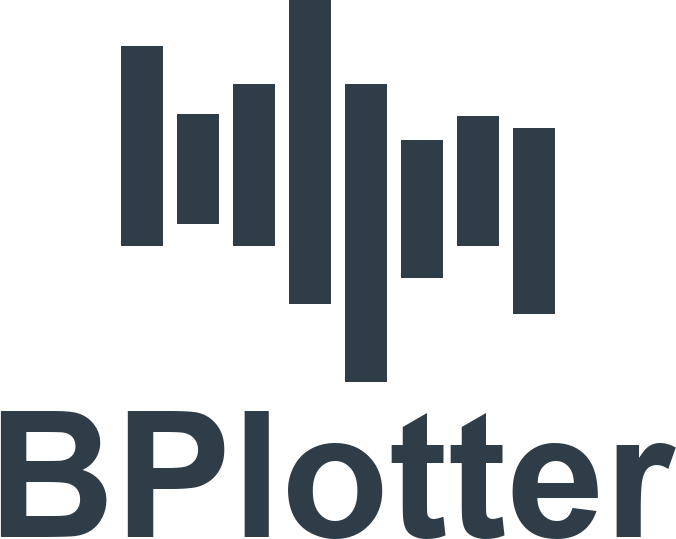

<h1>Google Benchmark Plotter</h1>

 

It is a project that easily allows to visualise the results of what google benchmark generates for its benchmarks.

### How to use it
As the app is still being developed there are no instructions on how to use it yet.

### Used Libraries
- **[SFML3](https://github.com/SFML/SFML)** - Simple and Fast Multimedia Library.
- **[spdlog](https://github.com/gabime/spdlog)** - Fast C++ logging library.
- **[result](https://github.com/martinmoene/result)** - A small error handling library using Result for modern C++.
- **[imgui](https://github.com/ocornut/imgui)** - Immediate Mode GUI for C++.
- **[ImGui-SFML](https://github.com/eliasdaler/imgui-sfml)** - ImGui binding for SFML.
- **[gtest](https://github.com/google/googletest)** - Google Test framework for C++ unit testing.
- **[gmock](https://github.com/google/googletest/tree/main/googlemock)** - Google Mock framework for C++ mocking.
- **[gbenchmark](https://github.com/google/benchmark)** - A microbenchmark support library for C++.